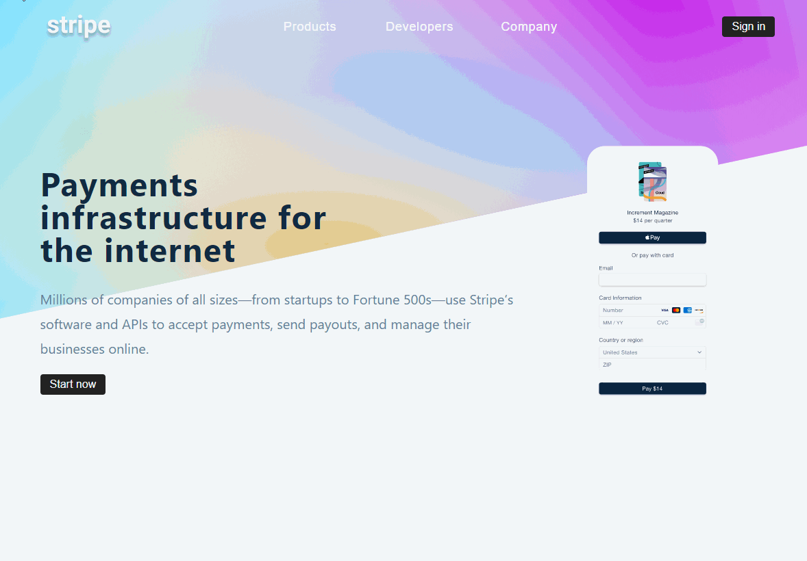

<h1 align="center">
  Stripe Submenu

## 💻 Project

- Learning ReactJS;
- A submenu navbar and modal built using hooks as useContext, useState, useEffect and useRef, as well as a custom hook for global context.
- To improve the DOM manipulation, was used conditional rendering, producing dynamic adjustments to set the more suitable 'width' style property for the submenu navbar.
- Design based on the website [https://stripe.com](https://stripe.com).

&nbsp;&nbsp;

---

## 🔥 Check it out!

 

- [https://stripe-submenu-app.netlify.app/](https://stripe-submenu-app.netlify.app/)

  

&nbsp;&nbsp;

